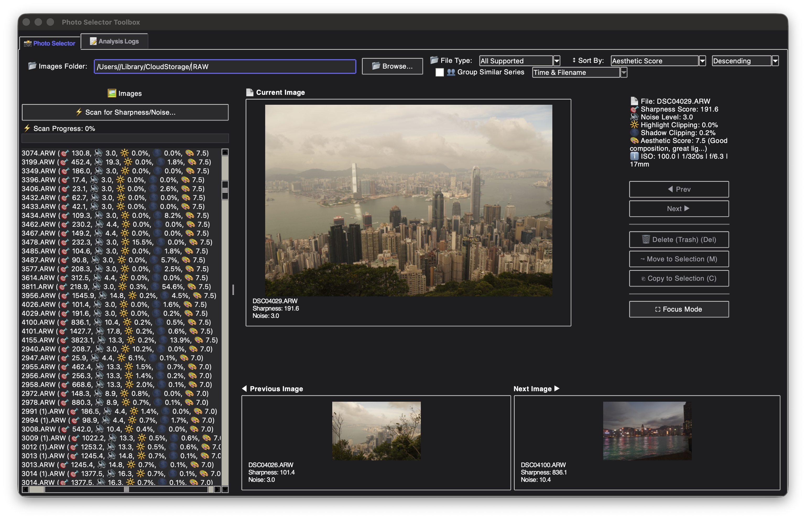
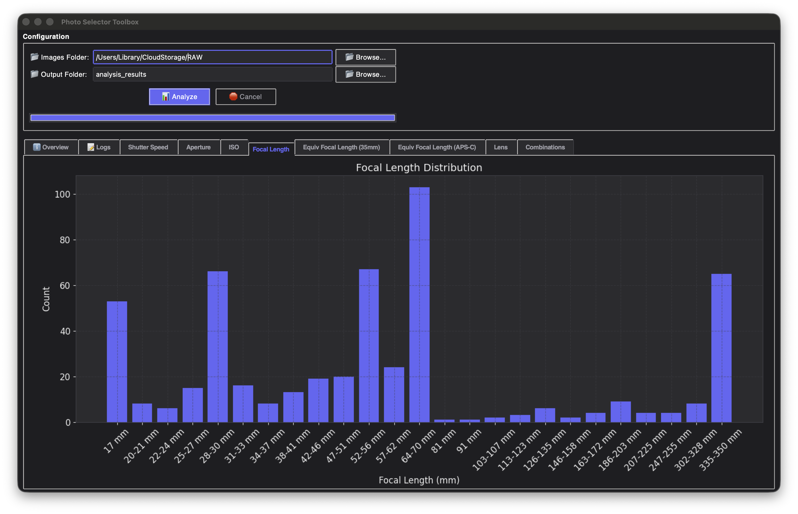
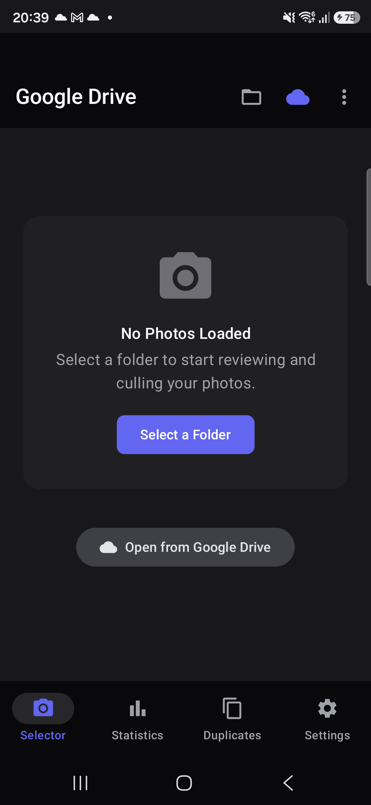
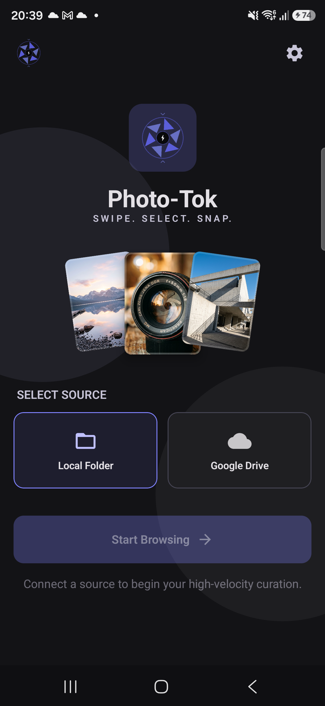

<div align="center">
  

  # Photo Selector Toolbox

  **The ultimate multi-platform ecosystem to cull, analyze, and organize your photo libraries with blazing speed — built for Desktop, Tablet, and Mobile.**

  [](LICENSE)
  [](https://www.python.org/)
  [](https://kotlinlang.org/)
  [](https://github.com/alexpp90/homebrew-photo-selector-toolbox/actions)
  [](https://github.com/alexpp90/homebrew-photo-selector-toolbox/releases/latest)
  [](#-desktop-installation)
  [](#-desktop-installation)
  [](#-desktop-installation)
  [](#-android-installation)

  <br />
  
</div>

---

## 🌟 The Ecosystem at a Glance

**Photo Selector Toolbox** is a privacy-first, high-velocity photo culling and metadata analysis suite designed for professional photographers, enthusiasts, and creators. Whether you are at your desktop workstation, reviewing on a tablet, or sorting on the go with your phone, we have a native solution tailored to your workflow.

> 🔒 **100% Private & Offline:** Your photos never leave your device. All EXIF parsing, duplicate detection, and quality evaluations (including local AI models) run strictly on-device. No cloud uploads, no subscriptions, no telemetry.

---

## 📦 Three Native Solutions, One Shared Repository

The repository targets three independent solutions optimized for their respective environments and UX models, while sharing high-level photographic domain concepts (like EXIF data structures and quality algorithms):

| Solution | Location | Tech Stack | Target Environment | Primary UX Paradigm |
| :--- | :--- | :--- | :--- | :--- |
| **Desktop Suite** | `src/` | Python 3.10+, Tkinter, OpenCV, rawpy | macOS, Windows, Linux | Menu & Keyboard-driven, split view |
| **Android Desktop** | `android/app/` | Kotlin, Compose, Room, OpenCV, Vico Charts | Samsung DeX, Large Tablets ($\ge 840$dp) | Mouse, Keyboard & Multi-Pane Touch |
| **Android Phone** | `android/phototok/` | Kotlin, Compose, DataStore (lightweight) | Portrait Mobile Phones ($< 600$dp) | Swipe-centric, Gesture-first ("Photo Tok") |

---

## 💻 1. Desktop Culling Suite (Python)

A full-featured Python command-line utility and custom Tkinter graphical interface optimized for high-throughput desktop curation.

<div align="center">
  
  <p><em>The clean, zinc-themed Desktop workspace in its initial state</em></p>
  
  <p><em>Interactive Library Statistics and EXIF histograms integrated into the dark theme</em></p>
</div>

### Key Features
*   **Dynamic Review Layouts:** Toggle between **Standard** mode (Current image on top, Previous/Next images side-by-side) and **Focus** mode (Current image and Controls split top, Previous/Next split bottom).
*   **Aesthetic & Quality Algorithms:**
    *   **Sharpness Score:** Crops the center 50% of the image, divides it into an 8x8 grid, and calculates the maximum block variance of the Laplacian filter.
    *   **Noise Level:** Estimates noise via Median Absolute Deviation (MAD) of the Laplacian filter:
        $$\sigma = \frac{\text{median}(|\nabla^2 I - \text{median}(\nabla^2 I)|)}{0.6745}$$
    *   **Highlight & Shadow Clipping:** Grayscale pixel thresholds highlighting blown highlights ($\ge 254$) and crushed shadows ($\le 2$).
    *   **Ollama AI Vision Integration:** Offline local VLM scoring ($1.0 - 10.0$) and analysis tags (e.g. `[ANALYSIS: Portrait]`) using base64-encoded $400 \times 400$ previews.
*   **Library Utilities:** Smart dHash-based grouping levels (Time & Filename, Fast, or Detailed) to automatically bundle burst sequences, and a SHA-256 duplicate finder with system trash fallback.
*   **ExifTool & SMB Mounting:** Bundled with ExifTool for robust raw file reading, and includes dynamic path resolvers for macOS and Linux network shares (`smb://`).

---

## 🖥️ 2. Android Desktop & DeX Companion

Built specifically for desktop mode environments like Samsung DeX, Chromebooks, and large-screen tablets, providing parity with the desktop culling workflow.

<div align="center">
  
  <p><em>Adaptive tablet layout running on Android, optimizing column viewports</em></p>
</div>

### Key Features
*   **Widescreen Viewports:** Supports a **Three-Column View** displaying Previous, Current, and Next images side-by-side in equal dimensions, as well as a **Focused View** layout.
*   **Desktop Ergonomics:** Hardware mouse pointer support (`PointerIcon.Hand` hover state) and physical keyboard shortcuts matching the desktop app (Left/Right to scroll, Backspace/Delete to trash, M/C to organize).
*   **Drag-and-Drop Imports:** Drag photo folder directories from Android file managers directly into the app window to import them instantly.
*   **SQLite Score Caching:** Persists analyzed image parameters in a local Room database with a rolling 10,000 image MRU capacity.

---

## 📱 3. PhotoTok Mobile Client

A lightweight, gesture-first, touch-optimized portrait client designed for quick, single-handed photo curation on your phone.

<div align="center">
  
  <p><em>Vertical TikTok-style culling with a gesture tutorial overlay and glassmorphic HUD</em></p>
</div>

### Key Features
*   **TikTok-Style Navigation:** Browse through local collections by swiping vertically up and down (`HorizontalPager` adapted to vertical scrolling).
*   **Fluid Swipes & Gestures:**
    *   **Swipe-Left to Discard:** Dragging progressive distance reveals a pulsing red trash icon, tilts the card ($2^\circ$), and fades it before executing trashing via `MediaStore`.
    *   **Double-Tap to Collect:** Instantly copies or moves the photo to your Selection folder with a bouncy green checkmark animation.
    *   **One-Tap HUD:** Single tap anywhere on screen hides/shows the glassmorphic metadata panel and controls to allow unobstructed viewing.
*   **Orientation-Aware Sorting:** Intelligently groups and sorts landscape images first, followed by portrait, or shuffles files randomly via the **Picture Randomization** settings toggle.
*   **Non-Blocking Undo:** Deletions are kept in a temporary state for 30 seconds with a quick Snackbar undo option before committing to disk or Google Drive.

---

## 📊 Platform Feature Sync Matrix

| Feature | Desktop | Android Desktop | Android Phone (PhotoTok) | Notes |
| :--- | :---: | :---: | :---: | :--- |
| **Image Review Layouts** | Standard / Focus | 3-Column / Focused | Vertical Pager | Desktop uses side-by-side; Phone utilizes vertical gesture pagers. |
| **Center Sharpness Score** | ✅ | ✅ | ✅ | Center 50% crop Laplacian variance check. |
| **Laplacian Noise (MAD)** | ✅ | ✅ | ✅ | Estimating noise with Median Absolute Deviation. |
| **Highlights/Shadows Clipping** | ✅ | ✅ | ✅ | Grayscale pixel thresholds $\ge 254$ and $\le 2$. |
| **SQLite Score Caching** | ✅ | ✅ | ❌ | Phone mode avoids local DB overhead to stay lightweight. |
| **Ollama Local AI VLM** | ✅ | ❌ | ❌ | Excluded from mobile to conserve battery and compute. |
| **Matplotlib / Vico Charts** | ✅ | ✅ | ❌ | Phone mode relies on simplified scrollable details. |
| **dHash Grouping Levels** | ✅ | ✅ | ❌ (Time-only) | Phone mode uses simple temporal burst checks. |
| **SMB Path Resolution** | ✅ | ❌ | ❌ | Android delegates remote directory shares via SAF. |
| **ExifTool Integration** | ✅ | ❌ (ExifInterface) | ❌ (ExifInterface) | Android uses native AndroidX ExifInterface. |
| **Picture Randomization** | ❌ | ❌ | ✅ | Phone settings toggle to shuffle loaded assets. |

---

## 🚀 Installation

### Desktop Installation

#### Homebrew (macOS & Linux)
Install the **stable** releases or rolling **nightly** builds:

##### macOS Cask (Includes GUI & CLI)
```bash
# Tap the repository
brew tap alexpp90/photo-selector-toolbox

# Install Stable
brew install --cask photo-selector-toolbox

# Install Nightly (includes latest features)
brew install --cask photo-selector-toolbox@nightly
```

##### Linux & macOS Formula (CLI-only, GUI on Linux)
```bash
# Tap and Install Stable
brew tap alexpp90/photo-selector-toolbox
brew install photo-selector-toolbox

# Install Nightly
brew install photo-selector-toolbox@nightly
```

#### Standalone Executables (Pre-built)
Download the standalone ZIP archives from our latest [GitHub Releases](https://github.com/alexpp90/homebrew-photo-selector-toolbox/releases) page. Bundled with **ExifTool** out of the box (no Python installation required).

| Operating System | Target Architecture | Archive Link |
| :--- | :--- | :--- |
| **Windows** | x64 | [Download ZIP](https://github.com/alexpp90/homebrew-photo-selector-toolbox/releases/download/nightly/photo-selector-toolbox-windows-x64.zip) |
| **macOS** | Apple Silicon (ARM64) | [Download ZIP](https://github.com/alexpp90/homebrew-photo-selector-toolbox/releases/download/nightly/photo-selector-toolbox-macos-apple-silicon.zip) |
| **Linux** | x64 | [Download ZIP](https://github.com/alexpp90/homebrew-photo-selector-toolbox/releases/download/nightly/photo-selector-toolbox-linux-x64.zip) |

---

### Android Installation

#### Option A: Obtainium (Direct Auto-Updates)
1. Install [Obtainium](https://github.com/ImranOmarRashid/Obtainium) on your Android device.
2. In Obtainium, click **Add App** and paste the URL of this repository.
3. Select your target release track (`stable` or `nightly`). Obtainium will download and install updates directly from GitHub Release assets with one click.

#### Option B: Firebase App Tester (OTA Previews)
Join our testing community to receive over-the-air previews via the **Firebase App Tester** application (available for invited developers/testers).

---

## 🛠️ Run from Source

### Desktop Setup (Python)
1. Ensure Python 3.10+ and Tkinter are installed:
   - **macOS:** `brew install python-tk`
   - **Linux:** `sudo apt install python3-tk`
2. Clone the repository and install dependencies using Poetry:
   ```bash
   git clone https://github.com/alexpp90/homebrew-photo-selector-toolbox.git
   cd homebrew-photo-selector-toolbox
   poetry install
   ```
3. Run the application:
   ```bash
   # Run GUI
   poetry run photo-selector-gui

   # Or use the CLI
   poetry run photo-selector-toolbox /path/to/photos [--output <dir>] [--show-plots] [--debug]
   ```

### Android Setup (Kotlin)
1. Open the `/android` directory inside **Android Studio Ladybug** (or newer).
2. Ensure JDK 17 and Android SDK 36 are configured.
3. Build the debug binaries:
   ```bash
   ./gradlew assembleDebug
   ```
   Debug APKs are output to:
   - `:app` (Toolbox): `android/app/build/outputs/apk/debug/`
   - `:phototok` (Photo Tok): `android/phototok/build/outputs/apk/debug/`

---

## 🧪 Testing

### Desktop Tests
Run unit and integration tests using pytest:
```bash
poetry run pytest
```
> [!NOTE]
> When executing GUI tests in headless Linux environments, run pytest using `xvfb-run` to prevent display exceptions:
> `poetry run xvfb-run pytest`

### Android Tests
*   **JVM Unit Tests:**
    ```bash
    ./gradlew testDebugUnitTest
    ```
*   **Instrumented Emulator Tests:**
    ```bash
    ./gradlew connectedDebugAndroidTest
    ```

---

## 📄 License
This project is licensed under the terms of the [MIT License](LICENSE).
Third-party notices and licenses are detailed in [THIRDPARTY_NOTICES.txt](THIRDPARTY_NOTICES.txt).
