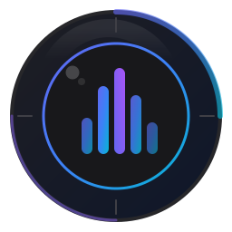
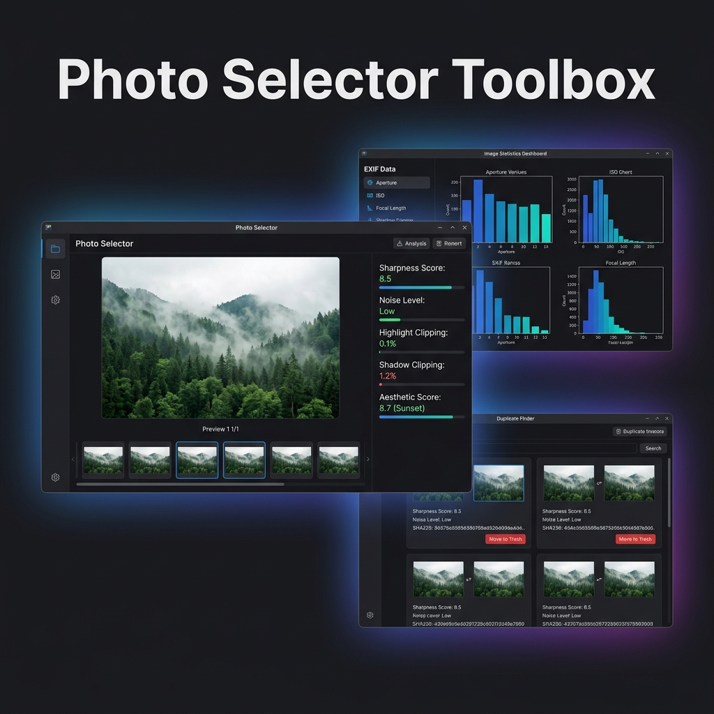

<div align="center">
  

  # Photo Selector Toolbox

  **The fastest way to cull, analyze, and organize your photos — on desktop and Android.**

  [](LICENSE)
  [](https://www.python.org/)
  [](https://kotlinlang.org/)
  [](https://github.com/alexpp90/homebrew-photo-selector-toolbox/actions)
  [](https://github.com/alexpp90/homebrew-photo-selector-toolbox/releases/latest)
  [](https://github.com/alexpp90/homebrew-photo-selector-toolbox/releases/tag/nightly)
  [](#-desktop-installation)
  [](#-desktop-installation)
  [](#-desktop-installation)
  [](#-android)

  <br />
  
</div>

---

## Why Photo Selector Toolbox?

You shot 800 photos this weekend. Now what?

Photo Selector Toolbox gives you a professional culling workflow — sharpness scoring, noise estimation, highlight and shadow clipping detection, duplicate finding, and EXIF statistics — across **every platform you own**. Desktop (macOS, Windows, Linux) and Android (tablets, phones, Samsung DeX). One unified vision, two native implementations, zero cloud dependency.

> **Your photos never leave your device. No subscriptions. No uploads. No compromises.**

---

## Desktop

A full-featured **Python/Tkinter** desktop application with GUI and CLI modes.

### Photo Selector & Review

- **Side-by-side comparison** — View previous, current, and next shots simultaneously in standard or focus mode
- **Fullscreen viewer** — Inspect at full resolution with a live metadata overlay showing sharpness, noise, clipping, and EXIF data
- **Keyboard-driven workflow** — Navigate, select, move, copy, and delete without touching the mouse
- **Move or Copy to Selection** — Organize picks into `Selection/` subfolders with automatic RAW + JPEG sorting
- **Dynamic file type filtering** — Focus your review on JPEG, RAW, or all supported formats

### Image Quality Analysis

Every image is scored automatically using computer-vision algorithms:

- **Sharpness** — Center-cropped 8x8 block variance grid analysis
- **Noise** — Median Absolute Deviation (MAD) of the Laplacian filter
- **Highlight clipping** — Percentage of blown highlights (intensity >= 254)
- **Shadow clipping** — Percentage of crushed shadows (intensity <= 2)
- **AI aesthetic scoring** — Local Ollama VLM integration for compositional analysis (fully offline, no cloud)

### EXIF Metadata Statistics

- **Distribution charts** — Shutter Speed, Aperture, ISO, Focal Length, Lens Model
- **Dark-themed Matplotlib plots** — Integrated into the app's zinc-based visual design
- **Interactive dashboard** — Overview cards and tabbed chart navigation

### Duplicate Finder

- **SHA-256 content hashing** — Finds true duplicates regardless of filename
- **Safe deletion** — Moves to trash first, with fallback to permanent delete

### Smart Image Grouping

Three configurable grouping levels for burst and series detection:

- **Time & Filename** — Fast grouping by capture time (30s window) and filename similarity
- **Time + Fast Similarity** — Adds perceptual dHash comparison within temporal candidates
- **Detailed Similarity** — Full pairwise dHash analysis for the most accurate grouping

### Broad Format Support

| Category | Formats |
|:---------|:--------|
| **Standard** | JPEG, TIFF, PNG, WebP |
| **RAW** | ARW, NEF, CR2, CR3, DNG, RAF, ORF, RW2, PEF, SRW, SR2, RAW |
| **High Efficiency** | HEIC, HEIF |

RAW preview loading is optimized via `rawpy` embedded JPEG extraction — no expensive sensor demosaicing required.

### Additional Capabilities

- **Network path resolution** — Seamlessly resolves `smb://` share URLs to local mount points
- **Persistent score cache** — SQLite-backed cache so you never recalculate scores
- **Multi-threaded processing** — Parallel metadata extraction and background analysis
- **Professional dark theme** — Zinc-based dark UI designed for prolonged editing sessions
- **Bundled ExifTool** — Ships with ExifTool for complete RAW metadata support out of the box

---

## Android

A **native Kotlin/Jetpack Compose** companion app built from the ground up for touch. Optimized for **large tablets and Samsung DeX**, with a dedicated phone mode that reimagines photo culling for one-handed use.

### Built for Android, Not Ported

This is not a web wrapper or a desktop port. The Android app uses a fully native stack — Jetpack Compose, Material 3, Kotlin Coroutines, Hilt, Room, and Coil — designed to feel right on every Android form factor.

| Component | Technology |
|:----------|:-----------|
| UI | Jetpack Compose + Material 3 |
| Architecture | MVVM + Clean Architecture |
| Async | Kotlin Coroutines + Flow |
| DI | Hilt |
| Image Loading | Coil 2 |
| Analysis | OpenCV Android SDK 4.x |
| EXIF | AndroidX ExifInterface |
| Charts | Vico (Compose-native) |
| Database | Room |
| File Access | Storage Access Framework (SAF) |
| Background Work | WorkManager |

### Adaptive Layout — Three Form Factors

The app uses **Material 3 Window Size Classes** to adapt seamlessly:

**Medium (600–840dp) & Expanded (>= 840dp) — Tablet / Samsung DeX**
Full desktop-class experience: NavigationRail, horizontal candidate strip, hardware keyboard shortcuts (arrow keys, Delete/Backspace, M, C, Escape), and a toggleable layout supporting either:
- **Three-Column View:** Previous, Current, and Next images side-by-side in equal dimensions for direct comparisons.
- **Focused View:** Large centered Current image on top, with Previous and Next images side-by-side at the bottom.

**Compact (< 600dp) — Phone**
A completely reimagined experience (see Phone Mode below).

### Phone Mode — TikTok-Style Photo Culling

Phone mode delivers a full-screen, gesture-first experience purpose-built for small screens:

- **Vertical pager** — Swipe up/down to browse photos, TikTok-style
- **Double-tap to collect** — Instantly copy or move to your collection with an animated checkmark flash
- **Swipe left to delete** — Progressive drag reveals a red delete indicator; release past the threshold to confirm
- **EXIF overlay** — ISO, shutter speed, aperture, focal length, and lens shown non-intrusively in the corner
- **Orientation-aware sorting** — Landscape shots first, then portrait, with a visual section divider prompting you to rotate your phone
- **Picture randomization** — Optional setting to shuffle the order of loaded pictures, overriding standard sorting
- **Gesture tutorial** — Animated onboarding overlay shown on first launch (and after a week away)

### Samsung DeX — Desktop-Grade on a Tablet

Photo Selector Toolbox is a **first-class Samsung DeX citizen**:

- **Resizable freeform window** with configurable default size (1024x768dp)
- **Mouse and keyboard input** — Full keyboard shortcuts (arrow keys, M/C/Delete/Backspace/Escape) when a hardware keyboard is connected
- **Density-aware** — Maintains consistent rendering when switching between tablet and DeX modes
- **Touchscreen optional** — Declared as `android:required="false"` so DeX mouse-only usage works perfectly

### Image Analysis — Same Algorithms, Mobile-Optimized

The Android app runs the **same computer-vision algorithms** as the desktop version — sharpness (8x8 block variance), noise (MAD of Laplacian), highlight/shadow clipping — but with mobile-specific optimizations:

- **Reduced thread pool** — `min(4, availableProcessors)` to conserve battery
- **Subsampled decoding** — `BitmapFactory.Options.inSampleSize` for analysis; full resolution only for display
- **Hardware bitmaps** — `Bitmap.Config.HARDWARE` for display, software bitmaps only during analysis
- **WorkManager integration** — Background scans survive process death

### Android-Exclusive Features

Features unique to the Android experience:

- **HEIF/HEIC and WebP** — Native Android format support beyond desktop capabilities
- **SAF-based file access** — Works with SD cards, USB drives, cloud providers, and network shares through Android's Storage Access Framework
- **Persistent URI permissions** — Folder access survives app restarts; quick-access list for recent folders
- **Snackbar-based undo** — 30-second undo window for single deletes instead of modal dialogs
- **Trash integration** — Uses Android 11+ `MediaStore.createTrashRequest()` for safe, system-level trash
- **Lazy image loading** — Coil-powered placeholders; thumbnails loaded first, full resolution on demand
- **Streaming SHA-256** — Duplicate detection via `DigestInputStream` — never loads an entire file into memory
- **DataStore preferences** — All settings persist across sessions via Jetpack DataStore

### What's Not on Android

A few desktop features are intentionally excluded:

| Feature | Why |
|:--------|:----|
| AI Aesthetic Scoring (Ollama) | Excessive battery drain, insufficient on-device compute |
| CLI Mode | No terminal equivalent on Android |
| SMB Path Resolution | Android handles network shares through SAF providers |
| ExifTool | Perl binary; replaced by AndroidX ExifInterface |

---

## Desktop Installation

### Homebrew (macOS & Linux)

The easiest way to install on macOS and Linux. Choose between **stable** and **nightly** builds:

#### macOS (Cask — Includes GUI & CLI)

<table>
<tr>
<th>Stable Release</th>
<th>Nightly Build (Latest Features)</th>
</tr>
<tr>
<td>

```bash
brew tap alexpp90/photo-selector-toolbox
brew install --cask photo-selector-toolbox
```

</td>
<td>

```bash
brew tap alexpp90/photo-selector-toolbox
brew install --cask photo-selector-toolbox@nightly
```

</td>
</tr>
<tr>
<td>

```bash
# Upgrade
brew upgrade --cask photo-selector-toolbox
```

</td>
<td>

```bash
# Upgrade (requires --greedy for unversioned casks)
brew upgrade --cask --greedy photo-selector-toolbox@nightly
```

</td>
</tr>
</table>

**One-liner install** (macOS, stable, interactive):

```bash
/bin/bash -c "$(curl -fsSL https://raw.githubusercontent.com/alexpp90/homebrew-photo-selector-toolbox/main/scripts/install-mac.sh)"
```

#### Linux & macOS CLI (Formula — CLI, plus GUI on Linux)

<table>
<tr>
<th>Stable Release</th>
<th>Nightly Build (Latest Features)</th>
</tr>
<tr>
<td>

```bash
brew tap alexpp90/photo-selector-toolbox
brew install photo-selector-toolbox
```

</td>
<td>

```bash
brew tap alexpp90/photo-selector-toolbox
brew install photo-selector-toolbox@nightly
```

</td>
</tr>
<tr>
<td>

```bash
# Upgrade
brew upgrade photo-selector-toolbox
```

</td>
<td>

```bash
# Upgrade
brew upgrade photo-selector-toolbox@nightly
```

</td>
</tr>
</table>

**One-liner install** (Linux, stable, interactive):

```bash
/bin/bash -c "$(curl -fsSL https://raw.githubusercontent.com/alexpp90/homebrew-photo-selector-toolbox/main/scripts/install-linux.sh)"
```

---

### Standalone Executable (Windows, Linux & macOS)

Pre-built binaries are available for every platform — no Python installation required.

| Platform | Download |
|:---------|:---------|
| **Windows** (x64) | [Download ZIP](https://github.com/alexpp90/homebrew-photo-selector-toolbox/releases/download/nightly/photo-selector-toolbox-windows-x64.zip) |
| **macOS** (Apple Silicon) | [Download ZIP](https://github.com/alexpp90/homebrew-photo-selector-toolbox/releases/download/nightly/photo-selector-toolbox-macos-apple-silicon.zip) |
| **Linux** (x64) | [Download ZIP](https://github.com/alexpp90/homebrew-photo-selector-toolbox/releases/download/nightly/photo-selector-toolbox-linux-x64.zip) |

> **Stable releases** are available on the [Releases](https://github.com/alexpp90/homebrew-photo-selector-toolbox/releases) page.

**Getting started:**

1. Download and extract the ZIP for your platform
2. Launch the application:
   - **GUI** — Double-click `photo-selector-gui` (or `Photo Selector Toolbox.app` on macOS)
   - **CLI** — Run `./photo-selector-toolbox` from a terminal

The standalone build ships with **ExifTool bundled** — no additional dependencies needed.

---

### Run from Source

For contributors and advanced users:

```bash
# Clone the repository
git clone https://github.com/alexpp90/homebrew-photo-selector-toolbox.git
cd homebrew-photo-selector-toolbox

# Install dependencies via Poetry
poetry install

# Launch the GUI
poetry run photo-selector-gui

# Or use the CLI
poetry run photo-selector-toolbox /path/to/photos [--output <dir>] [--show-plots] [--debug]
```

**System requirements:**
- Python 3.10+
- Tkinter (`brew install python-tk` on macOS, `sudo apt install python3-tk` on Linux)
- [ExifTool](https://exiftool.org) (recommended for RAW support; auto-detected from PATH)

---

## Android Installation

### Pre-built Releases (Recommended)

To automatically get the latest releases of the Android apps (**Photo Selector Toolbox** and **Photo Tok**) on your phone or tablet, you can use one of the following methods:

#### Option A: Obtainium (Direct from GitHub Releases)
1. Install [Obtainium](https://github.com/ImranOmarRashid/Obtainium) on your Android device.
2. In Obtainium, click **Add App** and paste the URL of this GitHub repository.
3. Obtainium will automatically check the GitHub Releases page (including the `nightly` release tag for bleeding-edge updates from the `main` branch) and prompt you to update with a single tap.

#### Option B: Firebase App Distribution (Over-the-Air)
1. Join the project's tester group (contact the administrator to add your email).
2. Install the **Firebase App Tester** app on your device.
3. Sign in to Firebase App Tester with your registered email to download the latest builds and receive OTA update notifications.

---

### Build from Source

```bash
cd android
./gradlew assembleDebug
```

The debug APKs are output to:
- **Photo Selector Toolbox (`:app`):** `android/app/build/outputs/apk/debug/`
- **Photo Tok (`:phototok`):** `android/phototok/build/outputs/apk/debug/`

**Requirements:**
- Android SDK with compileSdk 36
- JDK 17+
- Minimum device: Android 8.0 (API 26)

---

## Accessing Older Releases

All previous versions are preserved indefinitely on GitHub.

<details>
<summary><strong>Standalone Executables</strong></summary>

1. Visit the [GitHub Releases](https://github.com/alexpp90/homebrew-photo-selector-toolbox/releases) page
2. Scroll to your desired version tag (e.g., `v0.1.0`)
3. Download the ZIP for your platform from the **Assets** section

</details>

<details>
<summary><strong>Homebrew Cask / Formula</strong></summary>

To install a specific historical version:

1. Find the commit hash where the Cask (`Casks/photo-selector-toolbox.rb`) or Formula (`Formula/photo-selector-toolbox.rb`) was updated for that version in the [tap repository](https://github.com/alexpp90/homebrew-photo-selector-toolbox) history.
2. Install using the raw URL:
   - **Cask (macOS GUI)**:
     ```bash
     brew install --cask https://raw.githubusercontent.com/alexpp90/homebrew-photo-selector-toolbox/<COMMIT_HASH>/Casks/photo-selector-toolbox.rb
     ```
   - **Formula (Linux / macOS CLI)**:
     ```bash
     brew install https://raw.githubusercontent.com/alexpp90/homebrew-photo-selector-toolbox/<COMMIT_HASH>/Formula/photo-selector-toolbox.rb
     ```

</details>

---

## Development

### Desktop

```bash
# Build the standalone executable (downloads ExifTool automatically)
poetry run python scripts/build.py

# Run tests
poetry run pytest
```

> **Headless environments:** Use `xvfb-run` for GUI tests without a display:
> ```bash
> poetry run xvfb-run pytest
> ```

### Android

```bash
cd android

# Build debug APK
./gradlew assembleDebug

# Run unit tests
./gradlew testDebugUnitTest

# Run instrumented tests (requires device/emulator)
./gradlew connectedDebugAndroidTest
```

---

## License

This project is licensed under the [MIT License](LICENSE).

---

## Acknowledgments

Photo Selector Toolbox is built on excellent open-source software:

| Library | License |
|:--------|:--------|
| [ExifTool](https://exiftool.org/) by Phil Harvey | Artistic License |
| [PyExifTool](https://github.com/sylikc/pyexiftool) | BSD |
| [Pillow](https://python-pillow.org/) | HPND |
| [Matplotlib](https://matplotlib.org/) | BSD-compatible |
| [OpenCV](https://opencv.org/) | Apache 2.0 |
| [tqdm](https://tqdm.github.io/) | MIT / MPL |
| [ExifRead](https://github.com/ianare/exif-py) | BSD |
| [rawpy](https://github.com/letmaik/rawpy) | MIT |
| [Jetpack Compose](https://developer.android.com/jetpack/compose) | Apache 2.0 |
| [Coil](https://coil-kt.github.io/coil/) | Apache 2.0 |
| [Vico](https://patrykandpatrick.com/vico/) | Apache 2.0 |
| [Hilt](https://dagger.dev/hilt/) | Apache 2.0 |

See [THIRDPARTY_NOTICES.txt](THIRDPARTY_NOTICES.txt) for full license details.
